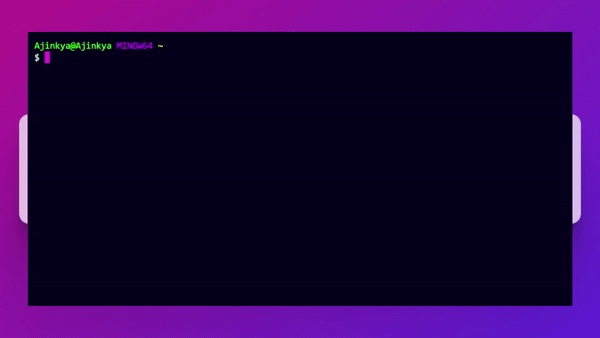
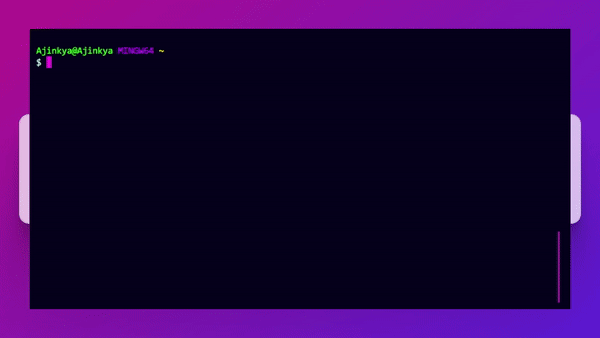
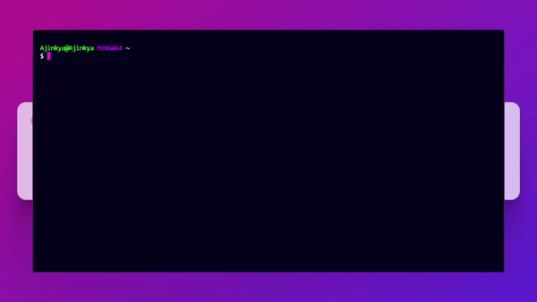

# 🧠 ContextCLI

ContextCLI is an AI-powered CLI tool that helps you to manage and organize your files and folders easily. The tool uses natural language processing and machine learning to understand your commands and perform the desired action.


## 💾Installation

To install ContextCLI, you need to have Node.js installed on your system. 

1) Clone the repository to your local machine:

```bash
  git clone https://github.com/ajinkyak423/ContextCli.git

```
2) Navigate to the project directory:


```bash
  cd ContextCli

```

3) Install the dependencies:

```bash
  npm install
  
```
### Making concli command available globally in the machine:
In order to use concli command available regardless of the folder you are in following steps need to be followed:  

1) Make cli.js an executable file using the command:
```bash
  chmod +x cli.js
  
```
to check it worked run the command:
```bash
 ll
```

2) Do the npm link in the folder where the cli.js file is present. This makes a global sim link.
```bash
  npm link
```

## 🖲️Usage
To use ContextCLI, simply open your terminal and type:

```bash 
concli p "your query for ai" -o output file name (with extention)
```
## 🖼️Demo

1) use `concli` command with `p` flag to give command 
note: give command in " " format.  




use `-o` flag to store output in external file  

2) Post Thread to Showwcase.  

  

3) Get trending shows and draft:  

  

4) Get your showwcase notifications:  

  


## 🚩 Contributing

Contributions are always welcome!

This project is still a work in progress, and we're open to collaboration with fellow developers who are interested in contributing to this project


## 🚀 Connect with me 
[](https://www.linkedin.com/in/ajinkya-kumbhar-0a439b202/)
[](https://twitter.com/ajinkyak423)

